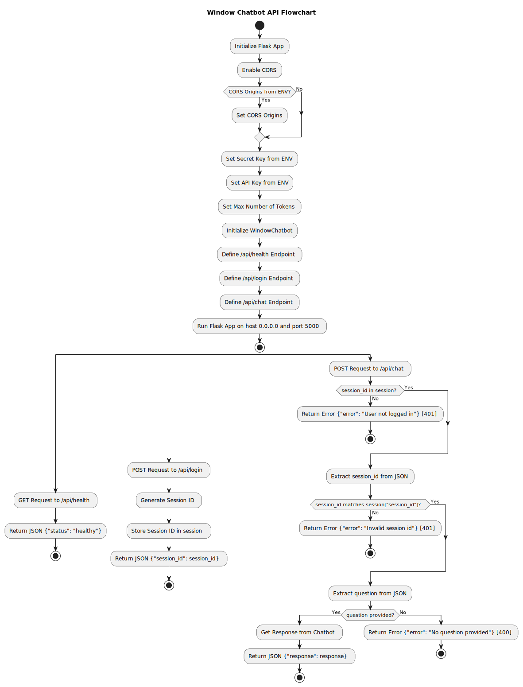

# Window Chatbot

Welcome to the Window manufacturing Chatbot expert! This project provides an implementation of a chatbot that can be used with ease in answering even the most complex questions about windows manufacturing. Let's get started!

## How to Run

### Build the app

Some environment variables that can be used to run the project quickly are already provided in the .env file. Feel free to replace them with your own! Building the app is as easy as running:

```
source .env
```

and

```
docker-compose build
```

That is it.

### Run the app

Now it is time to actually run the app and interact with the chat. To do so run:

```
docker-compose up
```

After running the app you should be able to access the chatbot at http://localhost:3000/

## Backend Flowchart


